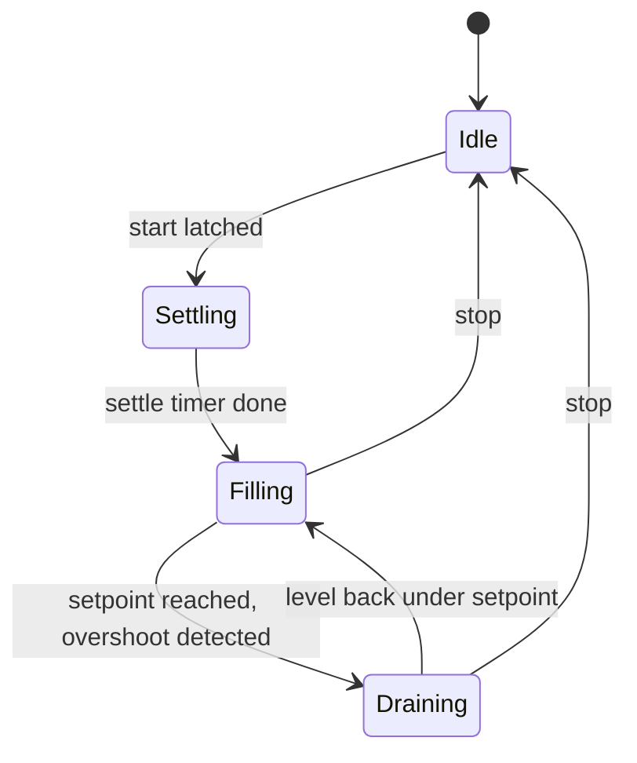

# Tank Filling System — Dual PID Level Regulation

A simulated industrial tank-filling process, controlled by a Siemens S7-1200 (TIA Portal) and modeled in Factory IO, using two independent PID_Compact controllers to regulate tank level around a live, operator-adjustable setpoint — correcting both under-fill and overshoot automatically.

## Demo


*(replace with your recording: full cycle — start, fill to setpoint, overshoot, discharge correction)*

Watch table trace (`sequence`, `pv_actual`, `PID_output`, `PID_output2`) — screenshot showing live regulation:


## What This Demonstrates

- Step-sequencer design using the CMP + MOVE pattern (consistent with the other projects in this portfolio)
- Closed-loop PID control with two cooperating, mutually-exclusive controller instances
- Correct handling of PID_Compact's output-clamping behavior, including signed output ranges
- Analog signal scaling (`NORM_X` → `SCALE_X` → `CONV`) for real-world engineering values
- Debugging a documented PLCSIM/S7-1200 platform limitation, not just application-level logic
- Defensive interlocking (start/stop latch, forced valve shutoff outside active states)

## Hardware / Software

| Item | Detail |
|---|---|
| CPU | S7-1200, CPU 1211C DC/DC/DC |
| Programming | TIA Portal, Ladder Logic (LAD) |
| Simulation | PLCSIM (standard) + Factory IO tank/level scene |
| Control blocks | 2× `PID_Compact` technology objects |

## I/O Table

| Signal | Address | Type | Role |
|---|---|---|---|
| Start | %I0.0 | Bool | Start pushbutton |
| Reset | %I0.1 | Bool | Reset pushbutton |
| Stop | %I0.2 | Bool | Stop pushbutton |
| FactoryIO Running | %I0.3 | Bool | Heartbeat from the simulation |
| Level meter (raw) | %IW30 | Int | Analog level signal, 0–27648 |
| Setpoint pot (raw) | %IW34 | Int | Analog setpoint dial, 0–27648 |
| Fill valve | %QW30 | Int | Proportional output, driven by PID_Filling |
| Discharge valve | %QW32 | Int | Proportional output, driven by PID_Drain |
| SP display | %QW34 | Int | Feeds Factory IO's setpoint readout |
| PV display | %QW36 | Int | Feeds Factory IO's level readout |

**Internal tags:** `pot_setpoint` / `pv_actual` (Real, scaled 0.0–300.0), `sequence` (%MW18, Int), `PID_output` (%MD24), `PID_output2` (%MD42), `fill_raw` / `discharge_raw` (Real, post-scaling).

## Control Architecture

### Signal scaling

Raw analog inputs are converted to engineering units before anything else touches them:

```
NORM_X (0–27648 → 0.0–1.0) → SCALE_X (0.0–1.0 → 0.0–300.0) → pot_setpoint / pv_actual
```

Scaled values are converted back to Int for the SCADA display words via `CONV`.

### Sequencer (state machine)

A single Int register (`sequence`, %MW18) supervises which controller is allowed to act. It does not "finish" — steps 20 and 30 hand off to each other continuously for as long as the system is running.



### Dual PID regulation

Rather than one PID with a signed, split output, this project uses **two independent `PID_Compact` instances**, mutually exclusive by construction — only one is ever enabled at a time, gated directly by the sequencer state:

| Instance | Enabled when | Output limits | Drives |
|---|---|---|---|
| `PID_Filling` (DB1) | `sequence == 20` | 0.0 to 100.0 | Fill valve (%QW30) |
| `PID_Drain` (DB2) | `sequence == 30` | **-100.0 to 0.0** | Discharge valve (%QW32) |

Both share the same `Setpoint` (`pot_setpoint`) and `Input` (`pv_actual`) — they're regulating around the same live target, just from opposite sides.

**Why the discharge loop's output range is negative:** `PID_Drain` only ever runs once the tank is already above setpoint, so its internal error (`Setpoint − Input`) is always negative by construction. Its output is converted back to a usable positive raw value with:

```
discharge_raw := PID_output2 × -276.48
```

The double negative (negative error × negative constant) produces a positive value proportional to the size of the overshoot — small overshoot, small correction; large overshoot, the valve opens further.

This design was chosen over a single split-output PID specifically because it makes it structurally impossible for both valves to fight each other — there is only ever one active controller, rather than two independently-tuned loops racing against the same process value.

## Debugging Notes

Real problems hit and fixed during development — not just "it works":

1. **Sequencer stuck at one step** — a compare instruction was left on its default `Int` type while comparing `Real` tags, so the transition condition silently never evaluated true.
2. **Valve stuck open after its controlling step ended** — disabling a `PID_Compact` instance's `EN` stops it from executing, but does **not** reset its output. Required explicit "force closed outside this state" networks.
3. **PID output tag corrupted by its own scaling logic** — a `MUL` instruction was writing its scaled result back into the same tag the raw `PID_Compact` output was stored in, overwriting the true controller value every scan it ran.
4. **PID_Compact silently clamped to zero, mode kept reverting to Inactive** — traced to a documented Siemens limitation: PID_Compact simulation via PLCSIM on an S7-1200 CPU is officially unsupported (full PLCSIM support is S7-1500 only), causing false sampling-time errors. Fixed by disabling `CycleTime.EnEstimation` / `CycleTime.EnMonitoring` and supplying a fixed `CycleTime.Value` matching the OB's configured cycle time, plus forcing `Mode := 3` (Automatic) and pulsing `ModeActivate` from an OB100 startup routine so the controller never needs manual restart from the Commissioning window.
5. **Discharge loop calculated a correct negative error internally but always output exactly 0.0** — its `Output value limits` had been left at the default `0.0–100.0`, silently clamping any negative result before it ever reached the `Output` pin. Fixed by setting that instance's limits to `-100.0 / 0.0`.
6. **OPC UA bridge connected but streamed no data, then wouldn't connect at all** — three separate causes found in sequence: the Node.js client hung during automatic certificate generation (fixed by setting security to None to match WinCC's anonymous access); a library import that didn't exist in the installed package (removed); and finally the real blocker — the bridge was pointed at the default endpoint `localhost:4840` when WinCC's actual OPC UA server was on a different host and port. Corrected the endpoint and data streamed immediately.

## Industry 4.0 — Live Web Dashboard (built)

Live PLC data is streamed to a browser dashboard over OPC UA, demonstrating an OT-to-web data pipeline without exposing the PLC directly to the network.

### Architecture

```
S7-1200 (standard PLCSIM, softbus-isolated)
   |  normal HMI-to-PLC tag connection
WinCC RT Advanced  — local HMI + OPC UA server
   |  OPC UA (opc.tcp)
Node.js bridge (node-opcua client) + built-in web server
   |  Server-Sent Events
Browser dashboard — live readouts + trend charts (Level vs Setpoint, Valve Outputs)
```

Because standard PLCSIM (not PLCSIM Advanced) is softbus-isolated and can't be reached by external tools directly, **WinCC RT Advanced acts as the gateway**: it connects to the simulated PLC the normal way and exposes the tags through its own OPC UA server, which the Node.js bridge then reads.

### How to run it

**Prerequisites (must be running, in this order):**
1. PLCSIM with the program downloaded and the CPU in RUN
2. Factory IO connected to PLCSIM
3. WinCC RT Advanced Runtime started (not just the engineering view) — its OPC UA server only listens while Runtime is actually running

**Find your OPC UA endpoint:**
- The endpoint is shown in WinCC's Runtime Settings and confirmable with a generic OPC UA client (UAExpert). It takes the form `opc.tcp://<hostname>:<port>` — note that WinCC RT Advanced does not always use the default port 4840, so check the actual value.
- Copy the exact Node IDs of the tags you want to stream (also visible in UAExpert, e.g. `ns=3;s=pv_actual`).

**Configure the bridge:**
- In `server.js`, set `endpointUrl` to your actual endpoint.
- In `server.js`, set the `nodesToMonitor` entries to your actual Node IDs.

**Start the local dashboard server:**
```bash
cd tank-web-dashboard
npm install express node-opcua-client
node server.js
```

Then open `http://localhost:3000` in any browser. The status badge shows "Live" once connected, and the readouts and trend charts update in real time as the process runs.

**Notes:**
- The OPC UA client connects with security set to None (anonymous), matching WinCC's default — no certificate exchange required.
- The dashboard uses Server-Sent Events to push updates to the browser; no database or cloud service is involved, it runs entirely locally.

## Known Limitations / Next Steps

- **PID_Compact instances require manual activation.** After a CPU restart or download, both `PID_Filling` and `PID_Drain` come up in Inactive mode and currently need to be started manually from each instance's Commissioning window. A fix is designed but not yet implemented in this project: an OB100 (Startup) routine that writes `Mode := 3` (Automatic) and pulses `ModeActivate` on both instances automatically, so no manual step is needed after a restart.
- Idle state (`sequence == 0`) does not yet force both valves closed on its own — currently relies on the active-state force-close rungs; worth adding an explicit override for full safety.
- Both PID loops are tuned independently but haven't been formally characterized against physical response curves — commissioning was done empirically via PLCSIM.
- The web dashboard is read-only (monitoring). Writing setpoints back to the PLC from the browser over OPC UA is a natural next step but isn't implemented.

## Tools Used

TIA Portal, PLCSIM, Factory IO, PID_Compact (technology object), WinCC RT Advanced (OPC UA server), Node.js (node-opcua), Chart.js
